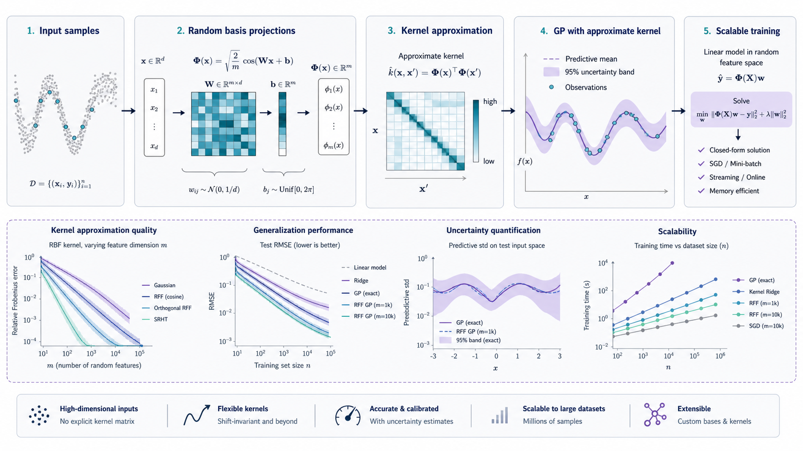

# Random Features

<p align="center">
  <a href="#license"></a> <a href="#paper-or-reference"></a> 
</p>

<p align="center">
  <strong>Conference-style artifact for scalable random-feature kernel experiments.</strong>
</p>

<p align="center">
  
</p>

## Abstract

This repository is organized as a conference-style artifact for random-feature approximations for kernel learning. It is written for a reviewer or collaborator who wants to identify the exact entry points, understand the expected outputs, and reproduce the core evidence without reverse-engineering the folder layout. The central question is: **How accurately do random features approximate kernel and GP-style behavior at scale?**

## Contribution Summary

- Dataset and utility modules.
- Deep GP random-feature implementation.
- Experiment folders for approximation studies.

## Artifact at a Glance

| Item | Details |
| --- | --- |
| Research question | How accurately do random features approximate kernel and GP-style behavior at scale? |
| Primary contribution | Dataset and utility modules; Deep GP random-feature implementation; Experiment folders for approximation studies |
| Main entry points | `dgp_rff.py`, `dataset.py`, `experiments/`, `likelihoods/`, `losses/` |
| Runtime | Python with NumPy, SciPy, scikit-learn, and Matplotlib |
| Data expectation | Benchmark folds and local experiment inputs |
| Expected evidence | Approximation errors, uncertainty plots, and scalability diagnostics |

## Repository Structure

| Item | Details |
| --- | --- |
| Entry points | `dgp_rff.py`, `dataset.py`, `experiments/`, `likelihoods/`, `losses/` |
| Experiment assets | Benchmark folds and local experiment inputs |
| Generated artifacts | Approximation errors, uncertainty plots, and scalability diagnostics |
| Documentation role | README records the reproducibility protocol, reviewer-facing checks, and citation metadata |

## Reproducibility Protocol

1. Clone the repository: `git clone git@github.com:Hik289/random-features.git`.
2. Prepare the runtime listed in **Artifact at a Glance**.
3. Start from the main entry points rather than auxiliary folders.
4. Run the smallest script or notebook first to verify local paths and package versions.
5. Record the command, data window, random seed, machine type, and software versions for each full run.
6. Store regenerated figures, logs, tables, checkpoints, or reports in named output folders so the original artifacts remain inspectable.

## Evaluation Protocol

| Check | Expected reviewer action |
| --- | --- |
| Entry-point clarity | Confirm the listed scripts or notebooks are the natural starting points. |
| Minimal execution | Run a small case before attempting the full experiment. |
| Output traceability | Map every regenerated output back to a command and data setting. |
| Result inspection | Compare generated artifacts with the expected evidence listed above. |
| Extension hygiene | Add new experiments as clearly named scripts, notebooks, or output folders. |

## Expected Results

A successful reproduction should produce or refresh the following evidence: Approximation errors, uncertainty plots, and scalability diagnostics. If local datasets or machine-specific paths are required, document those paths outside the committed code before sharing the artifact.

## Known Limitations

- Large datasets, private data paths, and machine-specific settings may need local configuration.
- Some historical notebooks or scripts may reflect exploratory runs; prefer the entry points listed above for review.
- For archival release, add a pinned environment file and a small public fixture when possible.

## Paper or Reference

No external paper link is currently attached to this project. Cite the repository snapshot when using the artifact in academic work.

## Citation

If a paper is attached, cite the paper first and this artifact second. Otherwise cite the repository snapshot used for the experiment.

```bibtex
@misc{random_features_artifact_2026,
  title = {{Random Features}},
  author = {Hik289},
  year = {2026},
  howpublished = {\url{https://github.com/Hik289/random-features}},
  note = {Conference-style research artifact}
}
```

## License

No explicit license file is included yet. Add one before public reuse, redistribution, or package release.

## Reviewer Checklist

| Claim | Inspection path |
| --- | --- |
| Code availability | Core scripts, notebooks, and utilities are tracked in this repository. |
| Reproducibility | The protocol above states setup, entry points, and output expectations. |
| Data transparency | Local or private data dependencies should be documented before external release. |
| Result traceability | Generated outputs should live in named result, report, log, checkpoint, or output folders. |
